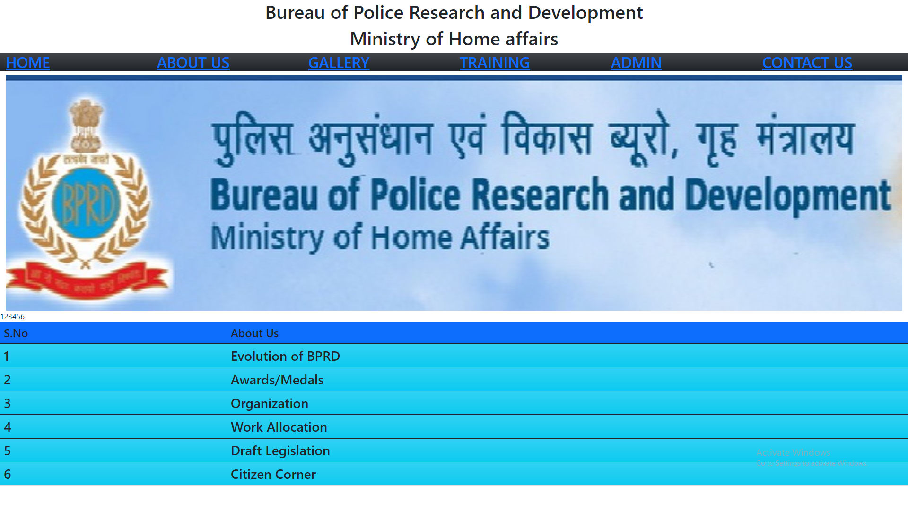
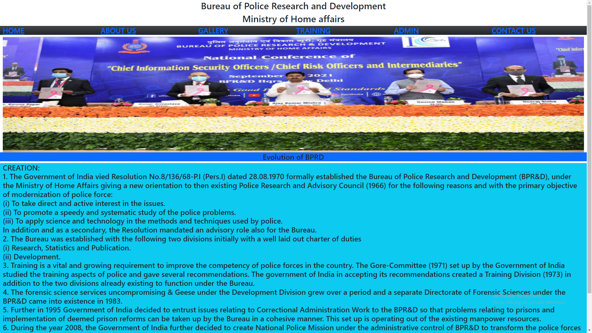
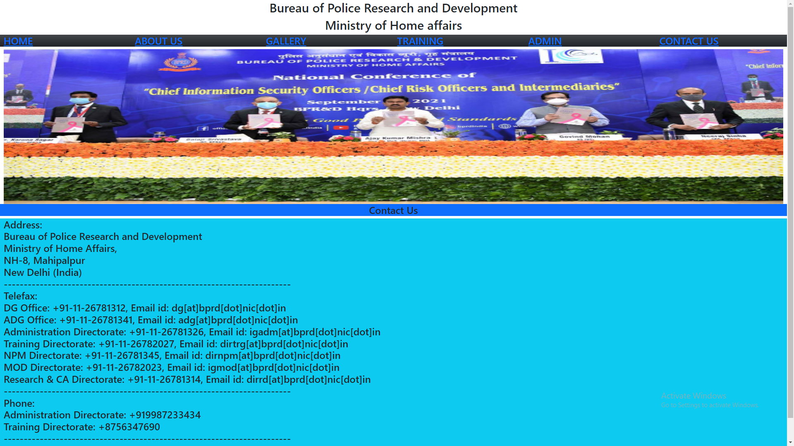

# Web Design using Bootstrap Framework

## AIM:
To design a website using bootstrap framework.

## DESIGN STEPS:

### Step 1:

Requirement collection.

### Step 2:

Creating the layout using bootstrap grid system.

### Step 3:

Updating the sample content.

### Step 4:

Choose the appropriate style and color scheme.

### Step 5:

Validate the layout in various browsers.

### Step 6:

Validate the HTML code.

### Step 6:

Publish the website in the given URL.

## PROGRAM :

### Home Page:
~~~
<!DOCTYPE html>
<html lang="en">
<head>
    <meta charset="UTF-8">
    <meta http-equiv="X-UA-Compatible" content="IE=edge">
    <meta name="viewport" content="width=device-width, initial-scale=1.0">
    <title>Bootstrap Website</title>
    <link href="https://cdn.jsdelivr.net/npm/bootstrap@5.0.2/dist/css/bootstrap.min.css" rel="stylesheet" integrity="sha384-EVSTQN3/azprG1Anm3QDgpJLIm9Nao0Yz1ztcQTwFspd3yD65VohhpuuCOmLASjC" crossorigin="anonymous">

</head>
<body>
    

        

            
Bureau of Police Research and Development

            
Ministry of Home affairs

            
<a href="/static/home.html">HOME</a>

            
<a href="/static/about.html">ABOUT US</a>

            
<a href="/static/gallery.html">GALLERY</a>

            
<a href="/static/training.html">TRAINING</a>

            
<a href="/static/admin.html">ADMIN</a>

            
<a href="/static/contactus.html">CONTACT US</a>

            
            <table class="table">
                <thead>
                    <tr>
                        <th  class="h4 bg-primary" scope="col">S.No</th>
                        <th class="h4 bg-primary" scope="col">About Us</th>
                    </tr>
                <tbody>
                    <tr scope="row">1</tr>
                    <td class="col-sm-3 h3 bg-info bg-gradient">1</td>
                    <td class="col-sm-9 h3 bg-info bg-gradient">Evolution of BPRD</td>
                </tbody>
                <tbody>
                    <tr scope="row">2</tr>
                    <td class=" col-sm-3 h3 bg-info bg-gradient">2</td>
                    <td class=" col-sm-9 h3 bg-info bg-gradient">Awards/Medals</td>
                </tbody>
                <tbody>
                    <tr scope="row">3</tr>
                    <td class=" col-sm-3 h3 bg-info bg-gradient">3</td>
                    <td class=" col-sm-9 h3 bg-info bg-gradient">Organization</td>
                </tbody>
            <tbody>
                <tr scope="row">4</tr>
                <td class="col-sm-3 h3 bg-info bg-gradient">4</td>
                <td class="col-sm-9 h3 bg-info bg-gradient">Work Allocation</td>
            </tbody>
            <tbody>
                <tr scope="row">5</tr>
                <td class=" col-sm-3 h3 bg-info bg-gradient">5</td>
                <td class=" col-sm-9 h3 bg-info bg-gradient">Draft Legislation</td>
            </tbody>
            <tbody>
                <tr scope="row">6</tr>
                <td class=" col-sm-3 h3 bg-info bg-gradient">6</td>
                <td class=" col-sm-9 h3 bg-info bg-gradient">Citizen Corner</td>
            </tbody>

                </thead>
            </table>

        

      
    

 
</body>
</html>
~~~
### About us page:
~~~
<!DOCTYPE html>
<html lang="en">
<head>
    <meta charset="UTF-8">
    <meta http-equiv="X-UA-Compatible" content="IE=edge">
    <meta name="viewport" content="width=device-width, initial-scale=1.0">
    <title>Bootstrap Website</title>
    <link href="https://cdn.jsdelivr.net/npm/bootstrap@5.0.2/dist/css/bootstrap.min.css" rel="stylesheet" integrity="sha384-EVSTQN3/azprG1Anm3QDgpJLIm9Nao0Yz1ztcQTwFspd3yD65VohhpuuCOmLASjC" crossorigin="anonymous">

</head>
<body>
    

        

            
Bureau of Police Research and Development

            
Ministry of Home affairs

            
<a href="/static/home.html">HOME</a>

            
<a href="/static/about.html">ABOUT US</a>

            
<a href="/static/gallery.html">GALLERY</a>

            
<a href="/static/training.html">TRAINING</a>

            
<a href="/static/admin.html">ADMIN</a>

            
<a href="/static/contactus.html">CONTACT US</a>

            
            <h2 class="text-center bg-primary">Evolution of BPRD</h2>
            

                CREATION: 

                1. The Government of India vied Resolution No.8/136/68-P.I (Pers.I) dated 28.08.1970 formally established the Bureau of Police Research and Development (BPR&D), under the Ministry of Home Affairs giving a new orientation to then existing Police Research and Advisory Council (1966) for the following reasons and with the primary objective of modernization of police force: 
                
                (i)    To take direct and active interest in the issues. 
                
                (ii)    To promote a speedy and systematic study of the police problems. 
                
                (iii)    To apply science and technology in the methods and techniques used by police. 
                
                In addition and as a secondary, the Resolution mandated an advisory role also for the Bureau. 
                
                2. The Bureau was established with the following two divisions initially with a well laid out charter of duties 
                
                (i)    Research, Statistics and Publication. 
                
                (ii)    Development. 
                
                3. Training is a vital and growing requirement to improve the competency of police forces in the country. The Gore-Committee (1971) set up by the Government of India studied the training aspects of police and gave several recommendations. The government of India in accepting its recommendations created a Training Division (1973) in addition to the two divisions already existing to function under the Bureau. 
                
                4. The forensic science services uncompromising & Geese under the Development Division grew over a period and a separate Directorate of Forensic Sciences under the BPR&D came into existence in 1983. 
                
                5. Further in 1995 Government of India decided to entrust issues relating to Correctional Administration Work to the BPR&D so that problems relating to prisons and implementation of deemed prison reforms can be taken up by the Bureau in a cohesive manner. This set up is operating out of the existing manpower resources. 
                
                6. During the year 2008, the Government of India further decided to create National Police Mission under the administrative control of BPR&D to transform the police forces in the country into effective instrument for maintenance of internal security and facing the challenges in future, by equipping them with the necessary material, intellectual and organizational resources. 
            
            
            

        </body>
        </html>
~~~
### contact us page:
~~~
<!DOCTYPE html>
<html lang="en">
<head>
    <meta charset="UTF-8">
    <meta http-equiv="X-UA-Compatible" content="IE=edge">
    <meta name="viewport" content="width=device-width, initial-scale=1.0">
    <title>Bootstrap Website</title>
    <link href="https://cdn.jsdelivr.net/npm/bootstrap@5.0.2/dist/css/bootstrap.min.css" rel="stylesheet" integrity="sha384-EVSTQN3/azprG1Anm3QDgpJLIm9Nao0Yz1ztcQTwFspd3yD65VohhpuuCOmLASjC" crossorigin="anonymous">

</head>
<body>
    

        

            
Bureau of Police Research and Development

            
Ministry of Home affairs

            
<a href="/static/home.html">HOME</a>

            
<a href="/static/about.html">ABOUT US</a>

            
<a href="/static/gallery.html">GALLERY</a>

            
<a href="/static/training.html">TRAINING</a>

            
<a href="/static/admin.html">ADMIN</a>

            
<a href="/static/contactus.html">CONTACT US</a>

            
            <h2 class="text-center bg-primary">Contact Us</h2>
            

                Address: 
             
                Bureau of Police Research and Development 
                Ministry of Home Affairs, 
                NH-8, Mahipalpur 
                New Delhi (India) 
                ------------------------------------------------------------------------ 

                Telefax: 
                DG Office: +91-11-26781312, Email id: dg[at]bprd[dot]nic[dot]in 
                ADG Office: +91-11-26781341, Email id: adg[at]bprd[dot]nic[dot]in 
                Administration Directorate: +91-11-26781326, Email id: igadm[at]bprd[dot]nic[dot]in 
                Training Directorate: +91-11-26782027, Email id: dirtrg[at]bprd[dot]nic[dot]in 
                NPM Directorate: +91-11-26781345, Email id: dirnpm[at]bprd[dot]nic[dot]in 
                MOD Directorate: +91-11-26782023, Email id: igmod[at]bprd[dot]nic[dot]in 
                Research & CA Directorate: +91-11-26781314, Email id: dirrd[at]bprd[dot]nic[dot]in 
                ------------------------------------------------------------------------ 

                Phone: 
                Administration Directorate: +919987233434 
                Training Directorate: +8756347690 
                ------------------------------------------------------------------------ 
            
            
            
            

        </body>
        </html>
~~~
## OUTPUT:
### Home page:

### About us page:

### Contact us page:

## Result:
A Website using the bootstrap framework is generated successfully.
